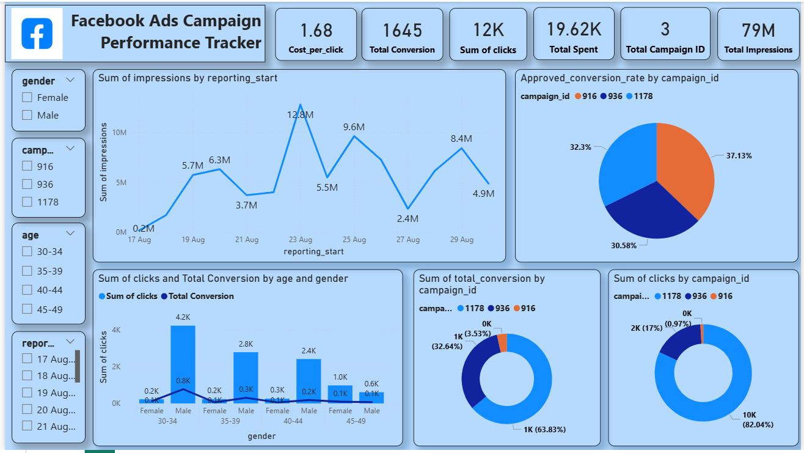
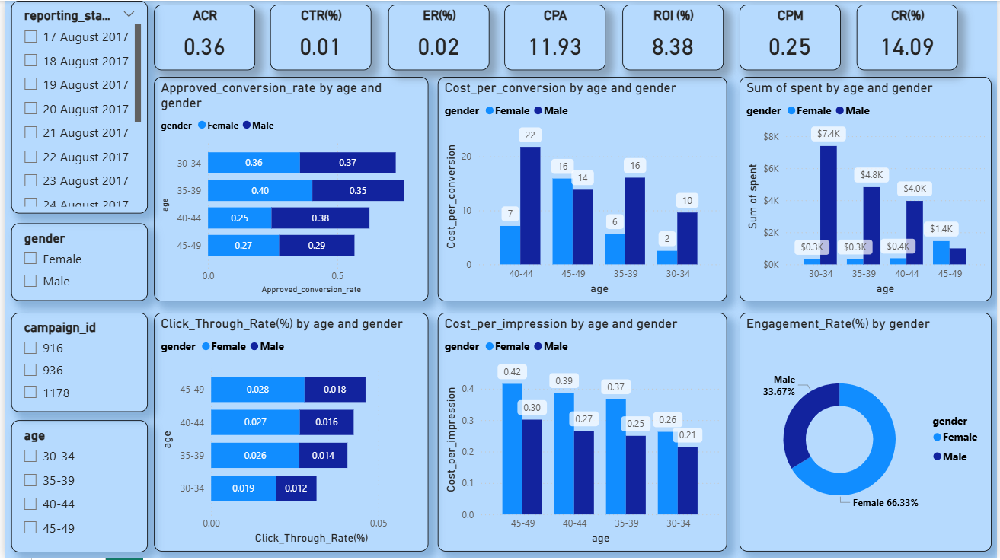

# 📊 Facebook Ads Campaign Performance Dashboard

### 🎯 Internship Task 2 – Data Science & Analytics (Future Interns)
**Track Code:** FUTURE_DS_02  
**Project Title:** Facebook Ads Campaign Performance Tracker  
**Tool Used:** Microsoft Power BI   
**Created by:** Priyank Shrivastava  

---

## 🧾 Project Overview

This project analyzes Facebook advertising data to evaluate the performance of multiple campaigns across demographic groups (age and gender), time, and budget utilization.  
The dashboard provides insights into impressions, clicks, conversions, and spend to help optimize ad targeting and improve ROI.

---

## 📂 Dataset Description

The dataset contains daily performance metrics for multiple Facebook ad campaigns.

| **Column Name**          | **Description** |
|---------------------------|----------------|
|"ad_id"                    |	Unique identifier assigned to each advertisement.
|"campaign_id"              |	Internal campaign ID used by the organization (XYZ company) to track individual ad campaigns.
|"fb_campaign_id"           |	Campaign ID used by Facebook to track each campaign on its platform.
|"age"                      |	Age group of the audience to whom the ad was shown.
|"gender"                   |	Gender of the targeted audience (e.g., Male, Female).
|"interest"                 |	Numeric code representing the interest category of the audience, based on Facebook profile data.
|"impressions"              |	Number of times the ad was displayed to users.
|"clicks"                   |	Total number of times users clicked on the ad.
|"spent"                    |	Total amount (in local currency) spent by the company to display the ad.
|"total_conversion"         |	Total number of people who enquired about the product after viewing the ad.
|"approved_conversion"      |	Number of people who purchased the product after viewing the ad.
---

## 📁 Folder Structure
│
├── Dashboard/
│   └──Facebook Ads Campaign.pbix
├── Dataset/
│   └── facebook_ads_data.csv
├── Images/
│   ├── Dashboard_1.png
│   └── Dashboard_2.png
├── README.md

---
## Dashboard Images

---

## ⚙️ Power BI Components Used

### 🧮 **Measures**
- **CTR** = Click Through Rate  
- **CPC** = Cost Per Click
- **CR** = Conversion Rate   
- **ER** = Engagement Rate 
- **CPA** = Cost per conversion
- **ROI** = Return on investment
- **CPM** = Cost per impression
- **ACR** = Approved Conversion Rate

---

## 📈 Visualizations

| **Visualization Type** | **Description** |
|-------------------------|-----------------|
| **KPI Cards** | Displays Total Impressions, Total Clicks, Total Spend, and Total Conversions |
| **Bar Chart** | Shows Approved Conversion Rate by Age and Gender Group |
| **Pie / Donut Chart** | Displays Conversion/Clicks Share by Gender and Age |
| **Line Chart** | Tracks Trend of Impressions over Time |
| **Matrix Table** | Shows Campaign ID vs. Demographics (CTR, Conversion Rate) |
| **Clustered Bar Chart** |Total clicks and Total Conversion by age and gender |
| **Slicers** | Filters by Age, Gender, Campaign ID, and Date Range |

---

## 🧰 Tools & Techniques Used

| **Category** | **Tools / Concepts** |
|---------------|----------------------|
| **Data Cleaning** | Power Query Editor |
| **Data Modelling** | DAX, Relationships |
| **Data Visualization** | Power BI Dashboard |
| **Performance Analysis** | CTR, CPC, Conversion Rate, Engagement Rate |
| **Insights Generation** | Trend Analysis, KPI Measurement, Cost Efficiency |

---

## 🔍Key Insights
- Campaign 1178 performed best with the highest clicks and conversions.
- Most ad spend is concentrated among males (87.5%), while females account for a smaller share.
- Male audience (age 30–34) delivered the strongest engagement .
- Impressions and conversions peaked around August 23, 2017. 
---

## 📸 Dashboard Previews

- **Dashboard 1:** Campaign Overview and Key Metrics  
- **Dashboard 2:** Performance based on age and gender

---

## 🏁 Conclusion

This Power BI dashboard provides an **end-to-end analysis of Facebook Ad campaign performance**.  
It helps marketing teams **identify effective campaigns**, understand **audience demographics**, and **optimize ad spending** for improved conversions.  

Interactive visuals, DAX measures, and dynamic filters enable data-driven insights into campaign success, efficiency, and engagement trends.

---

## 👨‍💻 Author

Name-Priyank Shrivastava
Email-priyankshrivastava5678@gmail.com